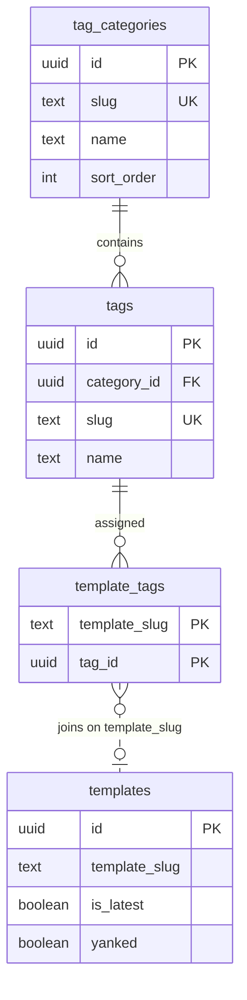

# Tagging System — Database Architecture

**Migration:** [`supabase/migrations/00005_tag_system.sql`](../../../supabase/migrations/00005_tag_system.sql)  
**Zod contracts:** [`packages/shared/src/tag-schema.ts`](../../../packages/shared/src/tag-schema.ts)  
**Storefront fetch:** [`apps/dashboard/src/lib/storefront-catalog.ts`](../src/lib/storefront-catalog.ts)

This document describes the **normalized** Supabase schema for advergaming template tags. Read it before adding features that touch storefront filters, admin tag management, or publish-time tag assignment.

---

## Design principles

| Principle | Rationale |
|-----------|-----------|
| **Normalized tables, not JSON blobs** | Tags are first-class rows with FK integrity, not denormalized arrays on `templates`. |
| **Key on `template_slug`, not `templates.id`** | Tags describe the **core product** (e.g. `catch-game`), not a specific published version row. Assignments survive republish. |
| **Global tag pool** | One `tags` table shared across all templates; admins create tags once, assign many times. |
| **Views for read paths** | Storefront reads go through views/RPC so filtering logic stays in Postgres, not scattered in UI. |
| **RLS by role + live-template gate** | `studio_admin` manages all tag data; authenticated users only see tags/categories attached to **live** templates (`is_latest = true`, `yanked = false`). |

---

## Entity relationship



---

## Core entities (5)

### 1. `public.tag_categories`

Global groupings for the storefront sidebar (e.g. Genre, Mechanic, Audience).

| Column | Type | Notes |
|--------|------|-------|
| `id` | `uuid` PK | `gen_random_uuid()` |
| `slug` | `text` UNIQUE | URL-safe kebab-case; used in grouped filter UI |
| `name` | `text` | Display label |
| `description` | `text` | Admin-only metadata |
| `sort_order` | `integer` | Sidebar category order (ascending) |
| `created_at`, `updated_at` | `timestamptz` | Auto-maintained via trigger |

**Constraints:** `slug` must match `^[a-z0-9]+(-[a-z0-9]+)*$`.

---

### 2. `public.tags`

The **global tag pool**. Every storefront filter chip and publish-modal autocomplete option resolves to a row here.

| Column | Type | Notes |
|--------|------|-------|
| `id` | `uuid` PK | Stable identifier for M:N joins |
| `category_id` | `uuid` FK → `tag_categories` | `ON DELETE RESTRICT` |
| `slug` | `text` UNIQUE | Used in `?tag=` storefront URL filters |
| `name` | `text` | Human label; unique per category |
| `created_at`, `updated_at` | `timestamptz` | |

**Constraints:**

- Global unique `slug` (kebab-case check).
- `UNIQUE (category_id, name)` — no duplicate labels within a category.

---

### 3. `public.template_tags` (M:N junction)

Links a **stable template identity** to global tags.

| Column | Type | Notes |
|--------|------|-------|
| `template_slug` | `text` | Matches `templates.template_slug` and local Studio `templateId` |
| `tag_id` | `uuid` FK → `tags` | `ON DELETE CASCADE` |
| `created_at` | `timestamptz` | Assignment timestamp |

**Primary key:** `(template_slug, tag_id)`

#### Why `template_slug` and not `templates.id`?

The registry may contain multiple rows per slug over time (version bumps). Tags belong to the **product**, not a version snapshot:

- Admins can assign tags **before** the first publish (slug exists on disk, no `templates` row yet).
- Republishing does not require copying tag rows to a new UUID.
- Storefront filters stay stable: `?tag=jump-and-run` always means “templates whose slug carries this tag,” regardless of semver.

#### Why no FK to `templates`?

`template_slug` is not guaranteed to exist in `templates` at assignment time. Integrity is enforced at the application layer (admin assigns known slugs) and at read time (views join only **live** template rows).

**Indexes:** `template_slug`, `tag_id`.

---

### 4. View — `public.published_tag_usage`

**Purpose:** Drive the storefront **sidebar filter** — only tags that matter to buyers.

Returns one row per tag that is attached to **at least one live published template**, with:

| Output column | Meaning |
|-------------|---------|
| `tag_id`, `tag_slug`, `tag_name` | Tag identity |
| `category_id`, `category_slug`, `category_name`, `category_sort_order` | Parent category |
| `usage_count` | `COUNT(DISTINCT template_slug)` on live templates |

**Live template definition (same everywhere):**

```sql
t.is_latest = true AND t.yanked = false
```

**Why this view exists:** The global `tags` table contains admin-created tags that may not yet be assigned, or may only be assigned to unpublished/yanked templates. Surfacing every tag in the sidebar would confuse users and leak draft taxonomy. This view is the **allowlist** for public filter chips.

**Security:** `security_invoker = true` — RLS on underlying tables applies to the caller.

**Privileges:** Admin API routes use `service_role` (`createServiceRoleClient`). Migration `00006_tag_system_service_role_grants.sql` grants table/view/function access to `service_role` (required in addition to RLS bypass).

**Consumers:**

- Direct `.from('published_tag_usage')` queries
- RPC `get_storefront_tag_filters()` (groups this view by category)

---

### 5. View — `public.published_templates_with_tags`

**Purpose:** Single read surface for the **storefront catalog** — latest published template row per slug, with tags aggregated for client-side display and `?tag=` filtering.

**Versioning resolution:**

```sql
WITH latest AS (
  SELECT DISTINCT ON (template_slug) t.*
  FROM public.templates t
  WHERE t.yanked = false
  ORDER BY t.template_slug, t.published_at DESC
)
SELECT ...
FROM latest l
WHERE l.is_latest = true
```

1. `DISTINCT ON (template_slug) … ORDER BY published_at DESC` picks the newest non-yanked row per slug (defensive against historical multi-row versioning).
2. `WHERE is_latest = true` aligns with the registry’s canonical “head” row.
3. Tags are joined via `template_tags.template_slug = l.template_slug` (slug-level, not row UUID).

**`tags` column:** JSON array built at query time:

```json
[
  {
    "id": "uuid",
    "slug": "jump-and-run",
    "name": "Jump and Run",
    "category_id": "uuid",
    "category_slug": "genre",
    "category_name": "Genre"
  }
]
```

This JSON is a **read projection only** — see [Prohibited patterns](#prohibited-storing-tags-as-json-on-templates) below.

**Consumers:** [`storefront-catalog.ts`](../src/lib/storefront-catalog.ts), Electron `store-ipc-utils.js`.

---

## Supporting RPC (not a core entity)

`public.get_storefront_tag_filters()` → `jsonb`

Groups `published_tag_usage` into nested `{ category, tags[] }` for the sidebar. Optional convenience; the view remains the source of truth for usage counts.

---

## Prohibited: storing tags as JSON on `templates`

**Tags must NEVER be persisted as plain JSON arrays on `public.templates`.**

Do **not** add columns like:

```sql
-- FORBIDDEN
ALTER TABLE templates ADD COLUMN tags jsonb DEFAULT '[]';
```

| Problem with JSON-on-row | Normalized alternative |
|------------------------|------------------------|
| No FK integrity — orphan strings, typos, duplicate slugs | `tags.id` + `template_tags` junction |
| Renaming a tag requires scanning every template row | Single `UPDATE tags SET name = …` |
| Cannot count tag usage or hide unused tags reliably | `published_tag_usage` view |
| Tag assignments lost or duplicated on republish | Stable `template_slug` junction |
| RLS cannot gate “public tags only on live templates” | Junction + live-template policies |

The `tags` JSON inside **`published_templates_with_tags`** is computed by a `LATERAL jsonb_agg(...)` subquery at read time. It is **not** stored on the table.

Application-layer contracts live in `@mashedgames/shared` (`TagSchema`, `TemplateTagSchema`, `SyncTemplateTagsInputSchema`). All writes go through `tag_categories`, `tags`, and `template_tags`.

---

## RLS summary

| Table | `studio_admin` | Authenticated (non-admin) |
|-------|----------------|---------------------------|
| `tag_categories` | Full CRUD | SELECT if category has a tag on a live template |
| `tags` | Full CRUD | SELECT if tag is on a live template |
| `template_tags` | Full CRUD | SELECT if linked slug is a live template |

Helper: `public.is_studio_admin()`. Service role bypasses RLS for admin API routes.

---

## Application integration map

| Surface | Read | Write |
|---------|------|-------|
| Admin Tag Manager (`/admin/tags`) | `/api/admin/tag-categories`, `/api/admin/tags` | Same + PATCH/DELETE |
| Publish modal (Content tab) | `/api/templates/{slug}/tags` | PUT sync → `template_tags` |
| Storefront sidebar | `get_storefront_tag_filters()` RPC | — |
| Storefront catalog | `published_templates_with_tags` + optional `?tag=` filter | — |

**Electron note:** Admin writes from the renderer use `admin:fetch` IPC — tokens stay in the main process ([`admin-api-client.ts`](../src/lib/admin-api-client.ts)).

---

## When changing this schema

1. Add a **new** migration (`0000X_*.sql`); never edit `00005_tag_system.sql`.
2. Update `packages/shared/src/tag-schema.ts` and regenerate `database.types.ts`.
3. Update this document if entity purpose or join keys change.
4. Keep storefront reads on views — do not bypass with ad-hoc joins in UI unless the view is insufficient.
